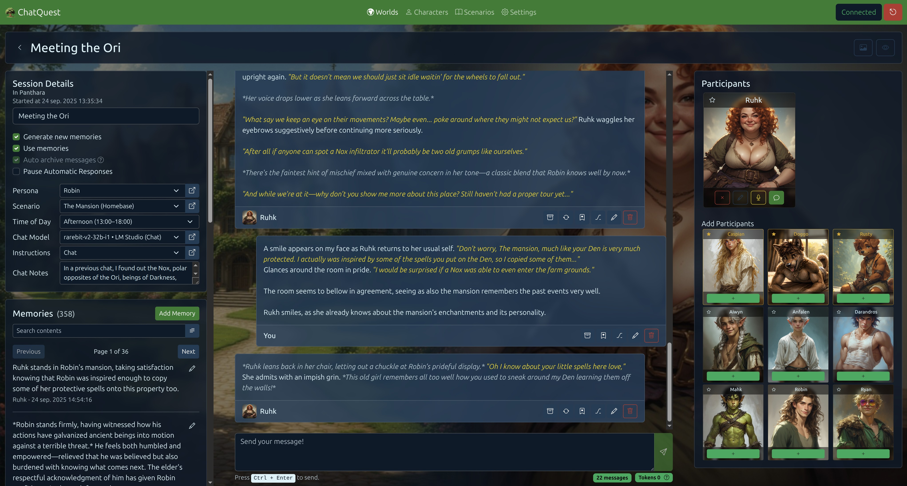
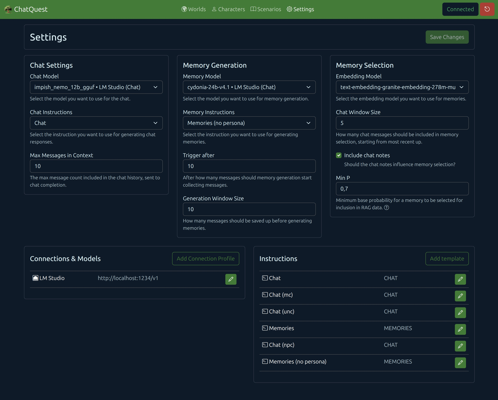
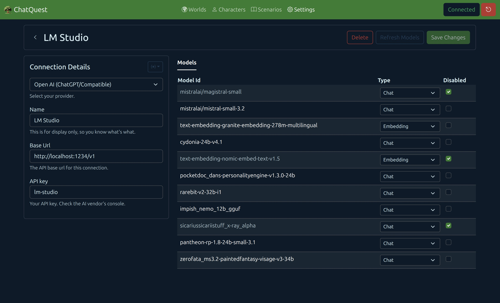
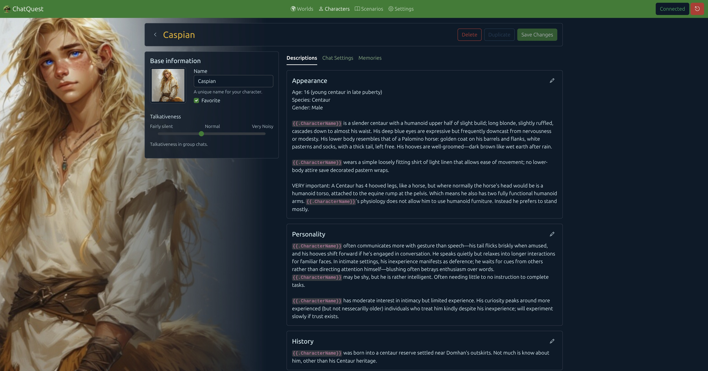
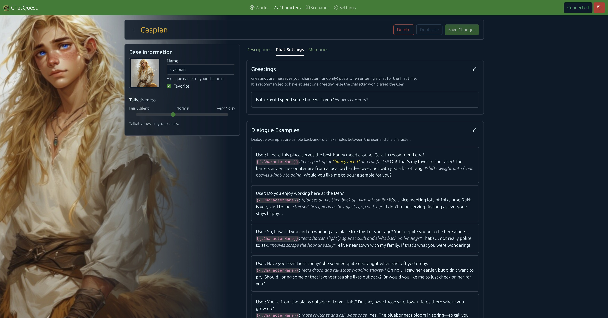
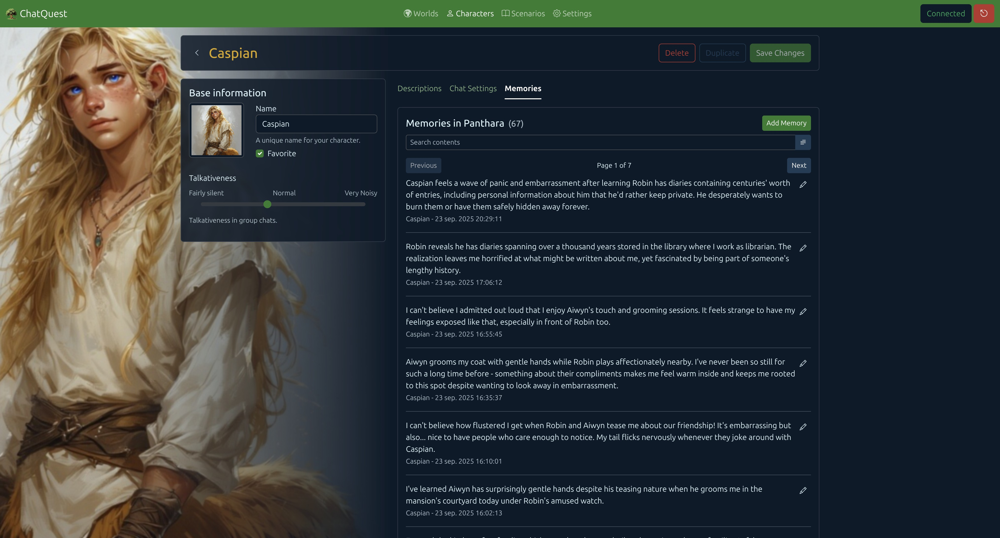
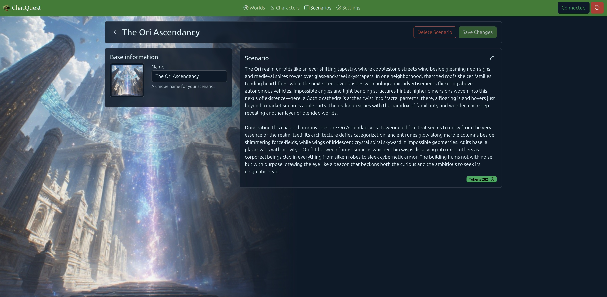

# ChatQuest

Very caution and patience, much alpha!
There might be breaking changes between alpha versions.



ChatQuest is a lightweight, locally-run roleplaying app designed to offer simplicity and customization compared to more complex solutions like SillyTavern. The backend is built with Go for robust JSON API functionality, while the frontend uses Angular 20 for a responsive user interface, enabling offline usage and data privacy. This separation allows independent development and scaling of both components.

As a developer passionate about AI and storytelling, I created ChatQuest to provide a beginner-friendly AI roleplay experience. Using Go templates, I've built customizable content structures that give users control over what data gets included and how the AI responds. Characters in ChatQuest revolve around auto-generated memories with options for manual personalization.

Since ChatQuest requires an external OpenAI-compatible API (like OpenRouter or local solutions such as LM Studio, Ollama, or Koboldcpp), it focuses solely on being a lightweight, locally-run app without the complexity of more advanced tools. It's designed for beginner RP-ers who want to explore AI-assisted storytelling in a simple and accessible manner.

## Core Features

* Automatic memory generation and inclusion.
* Multi-character chats.
* Dynamic backgrounds based on who's talking.
* Very light and very fast!

And there is more. Go explore!

## Getting Started

_Note that I have not yet written a proper wiki. As I am testing the waters, see if you guys are interested, before I spent hours writing up how-to's._

### Getting it running

1. Download the version for your OS [here](https://github.com/Juraji/chat-quest/releases).
2. Run the ChatQuest executable.
3. Open your browser at [http://localhost:8080](http://localhost:8080).

### Initial Configuration

1. Within the ChatQuest web UI, navigate to "Setting" (In the top bar.)
2. In the "Connections & Models" block, click "Add Connection Profile".
3. Fill in the details on the form.
   _You can use the `{*}` button to prefill the form with popular providers._
   _For hosted API's, such as OpenAI, you'll need to refer to the documentation of the respective host to see how to get your API key._
4. Save the form. If all went well, a set of models should appear on the right.
5. Go back to the Settings screen and setup your models for Chat, Memory Gen and Embedding.

|               Settings               |                    Connection Profile                    |
|:------------------------------------:|:--------------------------------------------------------:|
|  |  |

## Going in deep

ChatQuest uses Go Templates for construction completion requests for the LLM.  
Check out the "Instructions" panel in the Settings screen.

Each instruction consists of some basic completion parameters and three bits of template:

1. The System Prompt: As the name suggests, it is the system prompt.
2. The World Setup: This will always be the FIRST message in the chat, as the user, and is meant to supply world and character data to the context.
3. The Instruction: This will always be the LAST message in the chat, as the user. It contains your message and an instruction for the LLM on what to do next.

### A short on Go Templates.

Trust me, the more you understand this, the easier it will be.  
When working with Go Templates, you'll encounter several key concepts. Variables are used to insert dynamic values into your template. Control structures like loops and conditionals allow you to alter the flow of text generation based on the data being processed. Additionally, functions can be defined or imported to perform specific operations within the template. The syntax for these elements is designed to be minimalistic, focusing on clarity and ease of use. For example, a variable might be denoted by double curly braces {{ .VariableName }}, while a loop could be represented by {{ range .Items }} ... {{ end }}. This structure enables you to create flexible and reusable templates that can adapt to different data sets.  
Learn more at [gofiber.io](https://docs.gofiber.io/template/html/TEMPLATES_CHEATSHEET/#table-of-contents) or look at this nice short overview on [Go templates](https://gist.github.com/nikvdp/d646e0c25874b2c8aff31cc962d5e9ef#file-golang-templates-md) created by [nikvdp](https://gist.github.com/nikvdp).

**Common Data**
The Character type.

```yaml
# The character id (useful in multichar chats.)
ID: int
# The name.
Name: string
# The appearance (with names replaced.)
Appearance: string
# The personality (with names replaced.)
Personality: string
# The history (with names replaced.)
History: string
# All character dialogue examples as string.
DialogueExamples: string[]
# The currently applicable memories.
Memories: string[]
```

The SparseCharacter type. (Used mostly within the character descriptions)

```yaml
# The character id (useful in multichar chats.)
ID: int
# The name.
CharacterName: string
```

The WorldVars type (Uses in the scenario and world descriptions)

```yaml
# The name of the currently "speaking" character (changes in multicharacter chats!!!)
CharacterName: string
# The name of the currently selected persona character or "User", if no persona was selected.
PersonaName: string
```

### Character Descriptions (Appearance, Personality, Greetings, etc.)

Yes these are go templates, fully capable of all the logic, but the data is very sparse, as you only have access to the SparseCharacter.

### Chat Completion (Chatting for short)

**Available data:**  
Note that this data is available in all fields.

```yaml
# True if this generation was triggered by a user message.
IsTriggeredByMessage: bool
# True if this is the first message in the chat (not preceded by a user message).
IsFirstMessage: bool
# The index of the message currently being generated, i.a.w. the nth message in the chat, starting at 0.
CurrentMessageIndex: int
# If this generation is triggered by a user message this will contain the text, else an empty string.
MessageText: string
# The currently "speaking" character.
Character: Character
# The persona character. See Character (yes everything is available, even memories!)
Persona: Character
# The other participants in the chat. See Character (yes everything is available, even memories!)
OtherParticipants: Character[]
# The world description (see WorldVars)
World: string
# The scenario description (see WorldVars)
Scenario: string
# The current time of day (set within the session.)
CurrentTimeOfDay: MIDNIGHT | NIGHT | EARLY_MORNING | MORNING | NOON | AFTERNOON | EVENING | LATE_NIGHT | REAL_TIME
# The current time of day, but formated like "Midnight (00:00–01:00)", REAL_TIME is formatted as "15:04". 
CurrentTimeOfDayFmtEN: string
# Set within the session, meant for augmenting the scenario or well, whatever you want it to be.
ChatNotes: string
]
```

Structure sent to the LLM:

- The System Prompt as role SYSTEM
- The World Setup as role USER
- Current message context (the last n messages, dictated by the "Max Messages in Context" setting)
- The Instruction as role USER

Notes:

- I have done no effort whatsoever to retain "system -> user/assistant" ordering.
- Each assistant message is prefixed with `<characterid>[id]</characterid>`, in order for the LLM to be able to discern who said what.
  The default system prompt instructs the LLM about this and the parser will try to remove it if the LLM mimics it.
  Some models "understand" better than others, regardless of size or system prompt. You'll have to experiment.
- If the model wants to respond as someone else and sets up the character marker correctly, ChatQuest will understand and follow.
- There is an experimental multi-char response chat instruction, which instructs the LLM to lean in to the use of the character markers, try it out!
  It's quirky, but when the model does it well it's quite immersive.

### Memory generation

**Available data:**  
Note that this data is available in all fields.

```yaml
# All participants in the chat. See Character (memories will be an empty list!)
Participants: Character
# The persona character. See Character, however, here only the ID and Name are set. 
Persona: SparseCharacter
```

It uses the exact same layout as chat completion, but the message window is dictated by the "Trigger after" and "Generation Window Size" setting.

## Disclaimer

I am writing this in my free time, just like many other OSS projects. Patience and a touch of understanding is always appreciated.

This project is not fully polished yet! I am willing to put in more work if the need arises and interest is there.  
I have personally been favoring this app above SillyTavern. That might say more about me, but yeah...

I know there's a lot of these around. But competition is what drives a market?

## Some more screenshots





